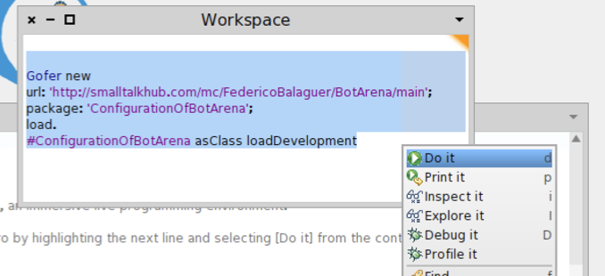
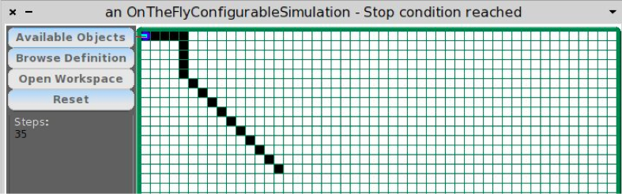

Orientación a Objetos 1 ­ 2014
==============================

Práctica 1 Introducción
-----------------------

En esta práctica usted aplicará los conceptos de objeto, envío de mensajes
método, resultado de un método y conocimiento (o estructura interna de un
objeto). Debe hacer esta práctica utilizando Smalltalk Pharo. Puede descargar
el programa Pharo desde la página oficial: http://pharo.org/download

Pharo es un ambiente de programación y un entorno de ejecución de aplicaciones
escritas en Smalltalk. Una vez instalado el ambiente, es necesario cargar el
código con el material que usaremos en estas primeras prácticas. Para ello

1. Abrir el ambiente haciendo click en el el archivo .image que se encuentra en
el directorio de instalación.

2. Una vez en Pharo, hacer click derecho en cualquier lugar del ambiente, se
abrirá un menú llamado World (tener en cuenta para pasos siguentes).

3. Abrir el menú World, y luego Workspace. Se abrirá una ventana nueva donde se
puede escribir código y ejecutarlo.

Para ejecutar código:

1. Seleccione el código a ejecutar  (todo el contenido del workspace)

2. Click derecho ­> (Menu)”Do it”



4. En el Workspace copie el siguiente código que se conecta a un repositorio y
descarga el ambiente de trabajo de esta práctica

```smalltalk
Gofer new
url: 'http://smalltalkhub.com/mc/FedericoBalaguer/BotArena/main';
package: 'ConfigurationOfBotArena';
load.
```

```smalltalk
#ConfigurationOfBotArena asClass loadDevelopment
```

5. Abrir el menú World nuevamente y elegir Save Image para guardar los cambios
producidos en la imagen Pharo. De esta forma, la próxima vez que abramos el
archivo .image ya tendrá todos estos cambios guardados.

Los pasos anteriores cargan en la imagen Pharo un sistema de mundos con Robots
que usaremos durante las primeras prácticas.

Para abrir la ventana con el mundo de robots, haga lo siguiente:

  * Abrir el menú World, y luego Workspace. Se abrirá una ventana nueva donde
    se puede escribir código y ejecutarlo.

  * Escribir el siguiente código:

```smalltalk
BGSArenaWindow beginnerViewOn: (OnTheFlyConfigurableSimulation batteryWalkingBrush).
```

  * Seleccionar todo el código y desde el menú del boton derecho del mouse
    elegir “Do It”.

    

Esto ejecutará el código Smalltalk y como resultado se abrirá una nueva ventana
con el mundo del robot.

El ambiente consta de una grilla en la que se mueve el robot y cuatro botones:

* “Available Objects”: muestra una lista de objetos disponibles
* “Browse Definition”: abre una ventana con la implementación del Robot
* “Open Workspace”: abre un workspace en donde puede mandar mensajes al Robot
* “Reset”: re­inicia el ambiente,

Click en el robot:  abre el inspector donde se pueden ver el estado del robot

El robot se mueve en un espacio de coordenadas cartesianas denominado la Arena.
El 0@0 es la esquina superior izquierda de la Arena. El robot inicia en el
medio de la grilla: 25@25.

El robot puede girar mirando hacia la dirección indicada (0 es norte, 270 oeste
y así siguiendo). Tenga en cuenta que el robot sólo puede mirar en direcciones
rectas o diagonales (ej, 45, 90, 135 pero no 91, 120).

                              North 0°

        West 270°           Posición Actual       East 90°

                              South 180°

El robot tiene una batería que disminuye su carga a medida que se mueve. Y
tiene la capacidad de dejar marcado su recorrido. Los mensajes que el robot
entiende son: `#brushDown`, `#brushUp`, `#isBrushDown`, `#isBrushUp`,
`#direction:`, `#move:`, `#battery`

Para enviar estos mensajes al robot, clickear el botón “Open Workspace” dentro
de la Arena y usar esa ventana, que cuenta además con algunos ejemplos.

Nota: la forma de indicar el nombre de los mensajes que entiende un objeto es
utilizando el símbolo # (más adelante en la cursada descubriremos por qué). De
esta forma si decimos que el robot entiende el mensaje `#brushDown` significa
que a la hora de enviarle el mensaje al robot robotech lo haríamos de la
siguiente forma: `robotech brushDown`

Ejercicio 1
-----------

Evalúe el siguiente bloque de expresiones en un nuevo ambiente:

```smalltalk
  robotech brushDown.
  robotech move:10.
  robotech west.
  robotech move:10.
  robotech south.
  robotech move:10.
  robotech east.
  robotech move:10.
  robotech north.
  robotech brushUp.
```

Ejercicio 2
-------------

Sin utilizar el ambiente del robot indique: ¿Cuál cree que será el resultado de
los siguientes envíos de mensaje si se los ejecuta luego de finalizar  las
expresiones del ejercicio 1?

   mensaje               | resultado
  -----------------------|-----------
   robotech position.    | 25@25
   robotech direction.   | 0
   robotech isBrushDown. | false


Ejercicio 3
-----------

1. Compruebe en el ambiente del robot que sus respuestas al ejercicio anterior
son correctas  (sugerencia: utilice `print it` o `inspect it`, en lugar de
`do­it`).

```smalltalk
  robotech position. "=> (25@25)"
```

```smalltalk
  robotech direction. "=> 0"
```

```smalltalk
  robotech isBrushDown. "=> false"
```

2. Abriendo un nuevo ambiente del robot investigue ¿Cuánta carga de batería
tiene al inicio? y ¿cuántas unidades puede avanzar el robot con esa carga?
`Tiene 100 de carga inicial con lo que puede avanzar 100 pasos.`

Ejercicio 4
-----------

* Utilizando el robot realice un rombo de lado 10 con alguna esquina en el centro de la grilla.

```smalltalk
  robotech
    brushDown;
    direction: 45;
    move: 10.
  3 timesRepeat: [ robotech direction: robotech direction + 90 ]
```

Ejercicio 5
-----------

En este ejercicio extenderemos la definición del robot para que sea capaz de
entender los mensajes: `#northEast`, `#northWest`, `#southEast`, `#southWest`.
Lea atentamente y siga el orden de los siguientes ejercicios antes de empezar a
implementar la funcionalidad.

1. Teniendo en cuenta la tabla del ejercicio 2, indique antes de extender la
definición, qué valores debería retornar el robot al enviarle los mensajes
`#position`, `#direction` y `#isBrushDown` si previamente se le envió alguno de
los mensajes `#northEast`, `#northWest`, `#southEast` y `#southWest`, como
ilustra la tabla.

   mensaje              |northEast  |northWest  |southEast  |southWest
  ----------------------|-----------|-----------|-----------|----------
   robotech position    |(25@25)    |(25@25)    |(25@25)    |(25@25)
   robotech direction   |45         |315        |135        |225
   robotech isBrushDown |false      |false      |false      |false

Los valores a completar pueden ser un valor concreto (ej: 135) o valores
indefinidos dependiendo del contexto. En caso de que dependan del contexto,
indique un ejemplo.

Para extender la definición del robot, es necesario abrir un navegador de
clases. Para esto, abra el menú World y luego System Browser. Allí podrá ver
todos los paquetes cargados en la imagen. Para acceder a la clase que
representa al robot, haga click derecho y elija “Find class…” para y halle la
clase WalkingBrushRobot.

1. Extienda la definición del robot agregando los mensajes: `#northEast`,
`#northWest`, `#southEast` y `#southWest`.

```smalltalk
northEast
  self direction: 45
```

```smalltalk
northWest
  self direction: 315
```

```smalltalk
southEast
  self direction: 135
```

```smalltalk
southWest
  self direction: 225
```

2. Compruebe que la implementación de los nuevos mensajes devuelve los valores
esperados comparándolos con lo completado en la tabla del punto 1.

Ejercicio 6
-----------

Resuelva el ejercicio 4 utilizando los mensajes definidos en el ejercicio 5.

```smalltalk
  robotech
    brushDown;
    northEast.
    move: 10.
  3 timesRepeat: [ robotech direction: robotech direction + 90 ]
```

Ejercicio 7
-----------

Explore la implementación de los mensajes del robot (los definidos en la
introducción).

a. ¿Cuáles son los objetos con los que el robot colabora?
`battery`

b) Preste atención, en cada caso, a la forma en que el robot interactúa con los
objetos a los que conoce. ¿Qué mensajes envía en esa interacción?

c) ¿Cual es el protocolo (cara visible) de la batería del robot?

Ejercicio 8
-----------

a)  Al hacer click en el robot se abre una ventana llamada inspector. Modifique
la definición del robot para que la información que aparece en el  inspector se
muestre en español.

```smalltalk
printOn: aStream

  aStream
    nextPutAll: 'Robot en ';
    nextPutAll: self position printString;
    nextPutAll: ', direccion ';
    nextPutAll: self direction printString.
```

b) Luego de estudiar el metodo `#move:` del robot, considere las diferentes
maneras de implementar el metodo `#trace:`. El metodo `#trace:` dibuja una
linea de la longitud que se pasa como parametro. Implemente la alternativa que
Ud.  considere se acerca a lo visto en la teoria de la materia sobre reuso y
programacion orientada a objetos

```smalltalk
trace: aDistance
  "dibuja una linea de una distancia dada"

  aDistance
    timesRepeat: [
      self
        brushDown;
        brushUp;
        move: 1 ]
```

Ejercicio 9
-----------

Dado el enunciado descripto abajo enuncie los objetos que puede identificar en
él. Describa textualmente el comportamiento esperable de cada objeto. Genere
una lista de mensajes que cada objeto deberá entender.

Un iPod es un reproductor de medios. Reproduce música, fotos y video. El iPod
presenta al usuario la lista de elementos que se pueden reproducir. Todos los
elementos tienen un nombre. Cuando el usuario opera el iPod selecciona algún
medio, por ejemplo una canción, y luego presiona el botón de play. En cualquier
momento el usuario puede decidir detener la reproducción, utilizando el botón
stop.

1. ¿Encuentra objetos que puedan ser organizados en una jerarquía? Si es así,
organícelos jerárquicamente.

2. ¿Qué comportamiento en común tienen?

3. Cuando el usuario enciende el iPod y este tiene que presentar la lista de
elementos que se pueden reproducir, qué objetos interactúan?

4. Liste al menos 2 mensajes que cada objeto deba entender.


Ejercicio 10
------------

El boton “Available Objects” abre una ventana con una lista de objetos que
estan disponibles para utilizar en el Workspace. Cada uno de los objetos tienen
un nombre el cual puede ser utilizado en el Workspace. Por ejemplo, el robot
está referenciado como “robotech”.  Cada uno de estos objetos pueden ser
“inspeccionados” enviandole el mensaje `#inspect` en el Workspace.

1. Inspeccione cada uno de los objetos disponibles en el Workspace

2. Inspeccione el objeto “battery” de robotech.

3. Imprima en el Workspace la carga actual de la bateria de robotech

```smalltalk
robotech battery charge "ctrl+p imprime el valor en el workspace"
```

4. Haga caminar al robot hasta que se agote la bateria y asigne la bateria de
resguardo (`#backupBattery`) que se encuentra disponible en el Workspace.

Ejercicio 11 (Avazado)
----------------------

1. Asigne el objeto designado `#endlessBattery` a robotech. Inspeccione este
objeto (`#endlessBattery`) y describa las diferencias y similitudes con
`#backupBattery`.

```smalltalk
robotech battery: EndlessBattery new
```

```
EndlessBattery es una clase q basicamente reimplementa `canConsume` y
`consume:` para que funcionen siempre
```

2. Basado en los metodos `#move:` y `#trace:` implemente el metodo  `#dash:`.
El metodo `#dash:` dibuja una linea punteada de longitud total equivalente al
parametro del metodo, y haciendo que los puntos y los espacios de la linea
punteada sean de longitud uno

```smalltalk
  dash: aNumber
    "hace una linea punteada de longitud anumber"

    aNumber // 2
      timesRepeat: [
        self trace: 1.
        self move: 1 ].
    aNumber odd
      ifTrue: [ self trace: 1 ]
```